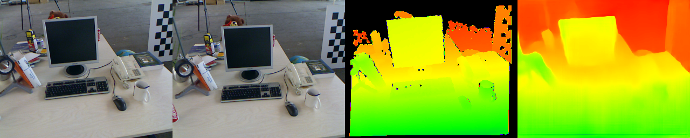
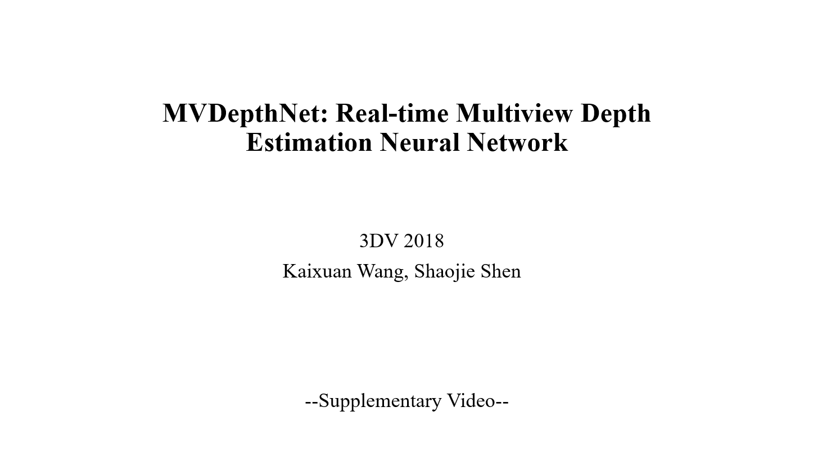

# MVDepthNet
## A Real-time Multiview Depth Estimation Network

This is an open source implementation for 3DV 2018 submission "MVDepthNet: real-time multiview depth estimation neural network" by Kaixuan Wang and Shaojie Shen. [arXiv link](https://arxiv.org/abs/1807.08563). If you find the project useful for your research, please cite:

```
@InProceedings{mvdepthnet,
    author       = "K. Wang and S. Shen",
    title        = "MVDepthNet: real-time multiview depth estimation neural network",
    booktitle    = "International Conference on 3D Vision (3DV)",
    month        = "Sep.",
    year         = "2018",
  }
```

Given multiple images and the corresponding camera poses, a cost volume is firstly calculated and then combined with the reference image to generate the depth map. An example is 



From left to right is: the left image, the right image, the "ground truth" depth from RGB-D cameras and the estimated depth map.

A video can be used to illustrate the performance of our system:

<a href="https://youtu.be/8jUlN-ZROl0" target="_blank"></a>

## 1.0 Prerequisites
+ **PyTorch**

The PyTorch version used in the implementation is 0.3. To use the network in higher versions, only small changes are needed.

+ **OpenCV**

+ **NumPy**

## 2.0 Download the model parameters and the samples

We provide a trained model used in our paper evaluation and some images to run the example code.

Please download the model via [the link](https://www.dropbox.com/s/o1n1w0chlrw4lqt/opensource_model.pth.tar?dl=0) and the sample images via [the link](https://www.dropbox.com/s/hr59f24byc3x8z3/sample_data.pkl.tar.gz?dl=0). Put the model ```opensource_model.pth.tar``` and extract the ```sample_data.pkl.tar.gz``` under the project folder.

## 3.0 Run the example

Just

```python example.py```

## 4.0 Use your own data

To use the network, you need to provide a left image, a right image, camera intrinsic parameters and the relative camera pose. Images are normalized using the mean ```81.0``` and the std ```35.0```, for example

```normalized_image = (image - 81.0)/35.0```.

We here provide the file ```example2.py``` to shown how to run the network using your own data. the ```left_pose``` and ```right_pose``` is the camera pose in the world frame. we show ```left_image```, ```right_image```, and the predicted depth in the final visualization window. A red dot in the ```left_image``` is used to test the relative pose accuracy. The red line in the ```right_image``` is the epiploar line that it much contains the red dot in the ```left_image```. Otherwise, the pose is not accurate. You can change the position of the tested point in line 56.

To get good results, images should have enough translation and overlap between each other.

### 4.1 Use multiple images

Please refer to ```depthNet_model.py```, use the function ```getVolume``` to construct multiple volumes and average them. Input the model with the reference image and the averaged cost volume to get the estimated depth maps.

## 5.0 Acknowledgement
Most of the training data and test data are collected by [DeMoN](https://github.com/lmb-freiburg/demon) and we thank their work.